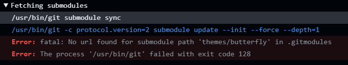

# 前言
博主之前的博客部署过程如下：
```shell
hexo clean 
hexo g
hexo d  #使用deployer模块生成可部署文件

git add .
git commit -m ""
git push #推送到远程github仓库

#前往github发布成release
```
整个过程可谓相当繁琐，且Github上保存的只有待部署静态文件，无法保存源码。

本次重启博客，发现`Github Actions`非常好用，只需将博客源码提交到hexo分支，并编写workflows文件，Github Actions就可以自动构建待部署静态文件，接着自动部署到Github Pages，该种方法既免去了繁琐的发布过程，同时保存了源码与待部署静态文件，便于其他同样想要使用Butterfly主题的开发者参考。既然博客开源那就贯彻到底！


提醒：本方法是在同一仓库生成两个分支用于存放源码和待部署静态文件，若你需要还可以将博客源码和部署文件分成两个仓库，具体操作请自行搜索


# 准备工作

- hexo博客 （能在本地正常运行）
- git bash
- github
- 良好的网络工具
- 任一文本编辑器

# Github仓库设置

## 新建仓库
新建一个仓库，名为`[username].github.io`，username使用你的github用户名。
## 获取Token
前往Github的设置中：https://github.com/settings/tokens
点击生成一个Token，我选的是classic，如图：

生成后先保存好Token的值（复制粘贴）
## 仓库设置
前往仓库添加Actions的变量，如图：

GH_TOKEN就填上面获取到的Token，GH_EMAIL就填你Github的注册邮箱。

# 本地博客设置
在你的博客根目录`git bash here`

## 连接远程仓库
首先执行以下命令，获取ssh钥匙：
```shell
ssh-keygen -t rsa -b 4096 -C "youremail@example.com"
```
将邮箱改成你Github的注册邮箱，接着一路回车，遇到 yes/no 输入yes即可。
接着输入以下命令获取公钥：

```shell
cat ~/.ssh/id_rsa.pub #获取公钥
```
去Github的设置中新建一个ssh key，名称随意，将公钥粘贴到其中即可。

如果你的博客尚未初始化，记得先执行：
```shell
git init
```
关联远程仓库，记得将链接改成你自己的仓库链接：
```shell
git remote add origin git@github.com:isrror/isrror.github.io.git
```
接着创建本地`master/mian`分支并推送：
```shell
git add .
git commit -m ""
git branch
git push -u origin master
```
新建`hexo`并转到`hexo`分支提交：
```shell
git checkout -b hexo
git push origin HEAD -u
```
此时去Github仓库看看可以发现两个分支。

# Github Actions设置
在博客根目录下新建`workflows`文件夹，新建`deployment.yml`文件，如图所示：

将以下内容填入其中：
```yml
name: Deployment

on:
  push:
    branches: [hexo] # only push events on source branch trigger deployment

jobs:
  hexo-deployment:
    runs-on: ubuntu-latest
    env:
      TZ: Asia/Shanghai

    steps:
    - name: Checkout source
      uses: actions/checkout@v2
      with:
        submodules: true

    - name: Setup Node.js
      uses: actions/setup-node@v1
      with:
        node-version: '20.x'

    - name: Install dependencies & Generate static files
      run: |
        node -v
        npm i -g hexo-cli
        npm i
        hexo clean
        hexo g
        
    - name: Deploy to Github Pages
      env:
        GIT_NAME: isrror //改成你的用户名
        GIT_EMAIL: ${{ secrets.GIT_EMAIL }}
        REPO: github.com/isrror/isrror.github.io //改成你的仓库
        GH_TOKEN: ${{ secrets.GH_TOKEN }}
      run: |
        cd ./public && git init && git add .
        git config --global user.name $GIT_NAME
        git config --global user.email $GIT_EMAIL
        git commit -m "Site deployed by GitHub Actions"
        git push --force --quiet "https://$GH_TOKEN@$REPO" master:master
```
具体参数可前往官网文档查看：https://support.github.com/ci-cd-devops
最后提交修改：
```shell
git add .
git commit -m "Github Actions"
git push origin hexo
```
之后每次修改后使用上述三行命令即可，也可以将其写成`.bat`文件更加方便。

# 一些坑
博主使用的butterfly主题，Github Actions报错如下：

错误为：无法找到子模块，甚至都找不到`.gitmodules`文件
原因尚且不明，猜测可能是：
1. Github Actions Runners更新（明日方舟maa提到了）
2. 本人使用的git clone方法安装的butterfly主题，因此导致模块无法识别
解决方法：新建一个`.gitmmodules`文件，写入以下内容
```yml
[submodule "themes/butterfly"]

  path = themes/butterfly

  url = https://github.com/jerryc127/hexo-theme-butterfly.git
```

参考文章：
- https://stackoverflow.com/questions/4185365/no-submodule-mapping-found-in-gitmodule-for-a-path-thats-not-a-submodule
- https://zhuanlan.zhihu.com/p/137867759
- https://worktile.com/kb/ask/208566.html
