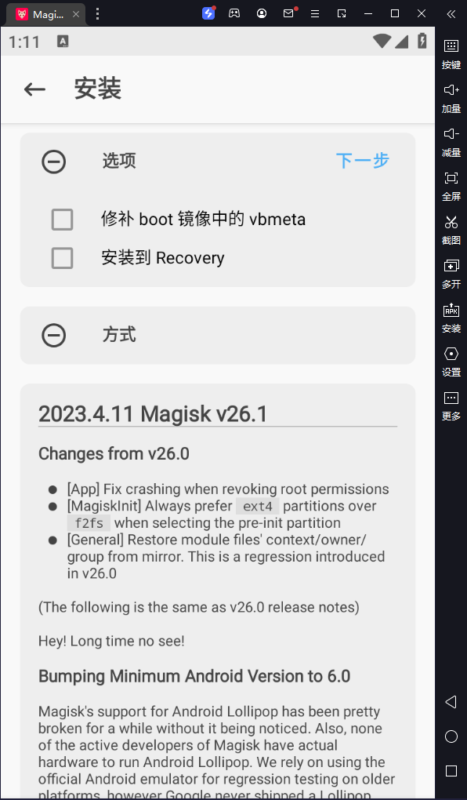
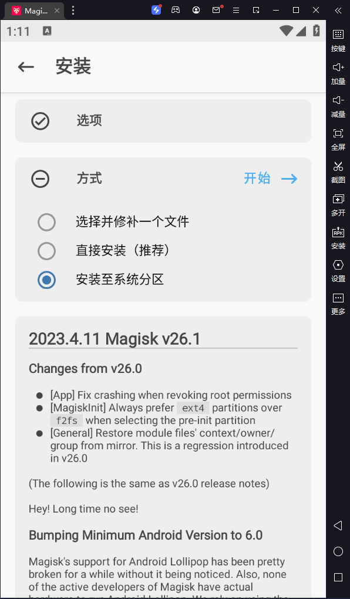
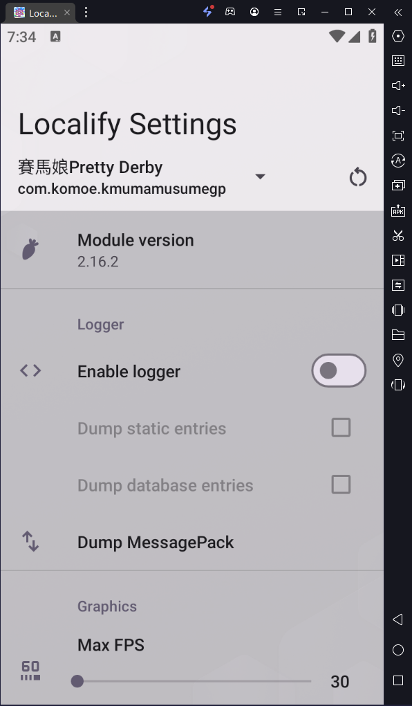
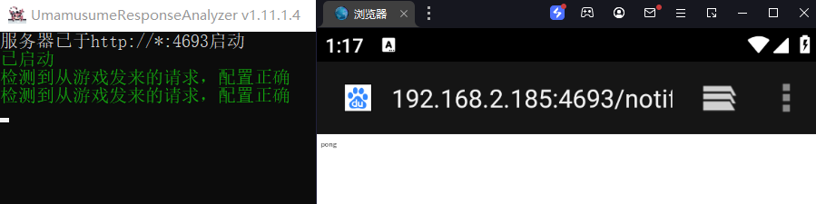

# 前言
UmamusumeResponseAnalyzer（后文简称URA）是一个赛马娘工具，项目地址为：
https://github.com/UmamusumeResponseAnalyzer/UmamusumeResponseAnalyzer
# 本文使用的工具版本

- 雷电模拟器9国内版：v9.0.61  官网地址: https://www.ldmnq.com/other/version-history-and-release-notes.html
- Magisk面具：Kitsune Magisk原名Magisk Delta v26-1 官网地址： https://huskydg.github.io/magisk-files/ 博主本人是在该网站下载的旧版： https://magisk-delta.en.uptodown.com/android 可以自行前往可信任的网站下载
- Localify模块：zygisk-umamusume-localify-2.16.2.with.vanilla.msgpack.hook-release.zip 下载地址： https://github.com/UmamusumeResponseAnalyzer/umamusume-localify-android/releases
- 用于设置localify的apk：Localify setting v1.6.0 下载地址： https://github.com/Kimjio/umamusume-localify-android/releases
- UmamusumeResponseAnalyzer：v1.13.2.2 下载地址： https://github.com/UmamusumeResponseAnalyzer/UmamusumeResponseAnalyzer/releases

# 从零开始的安装过程
## 模拟器下载设置

1. 雷电官网下载安装上述版本
2. 把`System.vmdk`和`Root`打开
3. 重启模拟器

## APP下载和文件操作
### 文件下载
下载安装Kitsune Magisk、localify setting和赛马娘繁中**谷歌版**
下载zygisk-umamusume-localify-2.16.2.with.vanilla.msgpack.hook-release.zip并拖入模拟器，放进共享文件夹中
### Magisk设置

1. 打开Kisune Magisk，勾选**永久允许Root**，点击Magisk旁边的安装，勾选**允许访问文件**
2. 重点来了：***关闭并重启Magisk***
3. 再次点击Magisk旁边的安装，第一步的选项**不要勾选**，第二步选择**安装至系统分区**，如图所示： 
4. 直接使用点击**模拟器右上角的重启**，*不要*使用Magisk的重启
5. 打开Magisk进入设置勾选Zygisk，返回，打开模块，选择从本地安装，进入共享文件夹（一般是Pictures），确认安装，**重启**（还是一样，使用模拟器的重启）

### Locatify的设置

1. 下载安装**赛马娘谷歌版**，运行游戏，到了登录界面就可以退出了，这步是为了生成Android/data/里的游戏数据文件
2. 打开Locatify setting，软件会自动选择赛马娘游戏文件夹，点击选择就好，正常情况如图所示：
3. 点击Dump MessagePack，打开开关，点击Notifier host，输入你的本机IP:4693
   如何获取IP？按Win+R，输入cmd打开命令行，输入`ipconfig`，找到你的ipv4地址即可。

## 电脑端软件下载
1. 下载URA本体
2. 点击更新数据
3. 启动
4. 验证连接：打开模拟器的浏览器，输入http://ip:4693/notify/ping，如果连接正常，会有正确信息输出，如图所示：

# 常见问题
1. Localify setting中找不到赛马娘数据文件夹：首先看有没有忘记打开赛马娘，进入到登录界面，其次看赛马娘版本，应使用*谷歌版*而不是mycard版
2. URA报错：自行查询项目issue，博主使用最新版的数据测试一切正常，如果需要使用旧版本，可以自行前往Release下载exe，并在QQ频道等渠道获取旧版本的br数据文件
3. 事件成功失败不显示：URA设置中打开selectindex，输出@1就是成功，@2则是失败